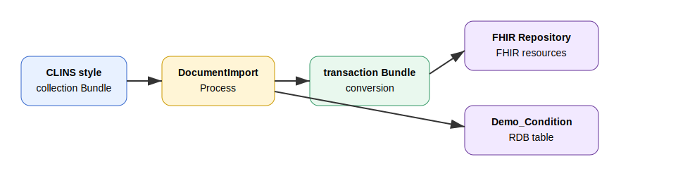
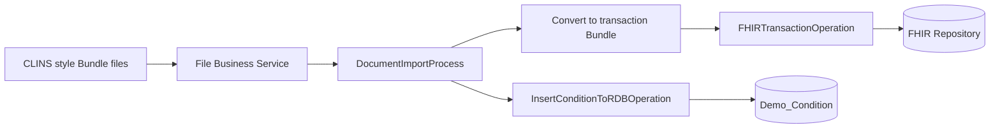

# FHIRBundleToFHIRRepo

CLINS スタイルの FHIR Bundle を受信し、FHIR transaction Bundle に変換して FHIR Repository に登録する InterSystems IRIS for Health サンプルです。

あわせて、Bundle に含まれる `Condition` リソースをシンプルな RDB テーブル `Demo_Condition` に格納します。

> このリポジトリに含まれるデータはすべて公開用に作成した合成データです。実患者データ、非公開データ、社内ホスト名、実認証情報は含みません。

## このサンプルの主眼

このサンプルの目的は、単に小さな FHIR リソースを登録することではありません。

主眼は以下です。

1. CLINS で扱われるような文書単位の Bundle を入力する
2. 入力 Bundle は `document` または `collection` 形式のまま保持する
3. Production 内で FHIR Repository 登録用の `transaction` Bundle に変換する
4. FHIR Repository に登録する
5. 同じ Bundle から `Condition` を抽出して RDB にも格納する

つまり、**CLINS スタイルの文書 Bundle を FHIR Repository と RDB の両方で活用する流れ**を確認するためのサンプルです。

## 全体像





## サンプルデータ

`data/samples/` には、同一患者 `SAMPLE-PATIENT-0001` に対する CLINS 風の合成 Bundle を 5 種類含めています。

| ファイル | 内容 | 主なリソース |
|---|---|---|
| `01_clins-style-referral-001.json` | 診療情報提供書 | Patient, Composition, Encounter, Condition, Observation, MedicationRequest |
| `02_clins-style-clinical-info-001.json` | 臨床情報 | Patient, Composition, Encounter, Condition, Observation, MedicationRequest |
| `03_clins-style-checkup-001.json` | 健診情報 | Patient, Composition, Encounter, Observation |
| `04_clins-style-discharge-summary-001.json` | 退院時サマリー | Patient, Composition, Encounter, Condition, Observation, MedicationRequest |
| `05_clins-style-followup-001.json` | 経過情報 | Patient, Composition, Encounter, Condition, Observation, MedicationRequest |

各 Bundle は入力サンプルとして `type: collection` にしています。FHIR Repository に直接 transaction POST するためのデータではなく、**この Production が transaction Bundle へ変換するための入力データ**です。

## ディレクトリ構成

```text
FHIRBundleToFHIRRepo/
├─ src/
│  └─ FHIRBundleToFHIRRepo/
│     ├─ DemoProduction.cls
│     ├─ BP/
│     │  └─ DocumentImportProcess.cls
│     ├─ BO/
│     │  ├─ FHIRSearchOperation.cls
│     │  ├─ FHIRTransactionOperation.cls
│     │  └─ InsertConditionToRDBOperation.cls
│     └─ Msg/
├─ data/
│  └─ samples/
├─ docs/
├─ sql/
├─ README.md
└─ README_en.md
```

## 処理の流れ

### 1. File Service が Bundle を受信

`FHIRBundleToFHIRRepo.FileIn` が `/tmp/fhirdemo/in/*.json` を監視します。

### 2. DocumentImportProcess が入力 Bundle を解析

`DocumentImportProcess` は、入力 JSON が FHIR `Bundle` であることを確認します。入力 Bundle は `collection` または `document` を想定しています。

### 3. Condition を RDB に格納

`InsertConditionToRDBOperation` に入力 Bundle を渡し、Bundle 内の `Condition` を抽出して `Demo_Condition` に INSERT します。ネストされた `Bundle.entry[].resource.resourceType = "Bundle"` の中も再帰的に検索します。

この Operation は起動時に `Demo_Condition` テーブルが存在するか確認し、存在しない場合は自動作成します。処理結果はイベントログに `Condition insert completed. Found=..., Inserted=..., Failed=...` の形式で出力します。

### 4. transaction Bundle を生成

`DocumentImportProcess` は、入力 Bundle の `entry.resource` から FHIR transaction Bundle を生成します。

生成される Bundle は以下のような形式です。

```json
{
  "resourceType": "Bundle",
  "type": "transaction",
  "entry": [
    {
      "fullUrl": "urn:uuid:...",
      "resource": { "resourceType": "Condition" },
      "request": {
        "method": "POST",
        "url": "Condition"
      }
    }
  ]
}
```

### 5. FHIR Repository に登録

`FHIRTransactionOperation` が FHIR endpoint に transaction Bundle を POST します。

失敗時は HTTP ステータスと FHIR `OperationOutcome` の本文をレスポンスに格納し、エラーとして返します。

## セットアップ

### 1. Namespace を用意

例として `FHIRDEMO` Namespace を使います。

### 2. クラスをインポート

```objectscript
ZN "FHIRDEMO"
Do $System.OBJ.LoadDir("/path/to/FHIRBundleToFHIRRepo/src", "ck", .errors, 1)
```

### 3. Production を開く

Management Portal で以下を開きます。

```text
Interoperability > Configure > Production
```

Production として以下を選択します。

```text
FHIRBundleToFHIRRepo.DemoProduction
```

## FHIR 接続設定

このサンプルでは、FHIR Repository 接続先をプレースホルダーにしています。

```text
Server: fhir.example.com
Port: 443
Https: 1
SSLConfiguration: DemoFHIRSSL
Credentials: DemoFHIRUser
BasePath: /csp/healthshare/fhirserver/fhir/r4
```

利用環境に合わせて、`FHIRSearchOperation` と `FHIRTransactionOperation` の設定を変更してください。

### Credentials の作成

Management Portal から以下を開きます。

```text
System Administration > Security > Credentials
```

例として以下を作成します。

| 項目 | 値 |
|---|---|
| ID | `DemoFHIRUser` |
| Username | 利用するFHIR endpointのユーザー名 |
| Password | 利用するFHIR endpointのパスワード |

### SSL/TLS Configuration の作成

HTTPS 接続を使う場合は、以下を開きます。

```text
System Administration > Security > SSL/TLS Configurations
```

例として `DemoFHIRSSL` を作成し、Client 用の SSL/TLS 設定として利用します。

検証環境ではサーバー証明書検証を緩和する構成もありますが、公開環境・本番環境では適切な証明書検証を有効にしてください。

## サンプル投入

Production の File Service は以下を監視します。

```text
/tmp/fhirdemo/in
```

必要なディレクトリを作成します。

```bash
mkdir -p /tmp/fhirdemo/in /tmp/fhirdemo/work /tmp/fhirdemo/archive
```

サンプルをコピーします。

```bash
cp data/samples/document/*.json /tmp/fhirdemo/in/
cp data/samples/collection/*.json /tmp/fhirdemo/in/
```

## FHIR データ確認API例

登録後、FHIR Repository に対して以下のように確認できます。endpoint、認証、BasePath は環境に合わせて変更してください。

### Patient 確認

```bash
curl -u username:password \
  "https://fhir.example.com/csp/healthshare/fhirserver/fhir/r4/Patient?identifier=SAMPLE-PATIENT-0001"
```

### Condition 確認

```bash
curl -u username:password \
  "https://fhir.example.com/csp/healthshare/fhirserver/fhir/r4/Condition?subject=Patient/sample-patient-0001"
```

### Composition 確認

```bash
curl -u username:password \
  "https://fhir.example.com/csp/healthshare/fhirserver/fhir/r4/Composition?subject=Patient/sample-patient-0001"
```

## RDB確認SQL

```sql
SELECT
  BundleId,
  PatientIdentifier,
  PatientName,
  ConditionCode,
  ConditionText,
  ClinicalStatus,
  RecordedDate
FROM Demo_Condition
ORDER BY CreatedAt;
```

テーブル定義は `sql/create_demo_condition.sql` にも含めています。

## 注意事項

- サンプルデータは CLINS 風の構造を再現した合成データです。
- 実際の CLINS 仕様や運用上のすべての項目を網羅するものではありません。
- FHIR Repository の認証方式や endpoint は環境により異なります。
- 本サンプルは学習・PoC 用です。本番利用時はエラー処理、冪等性、監査ログ、リトライ設計を追加してください。
